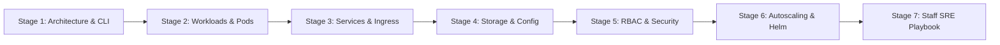
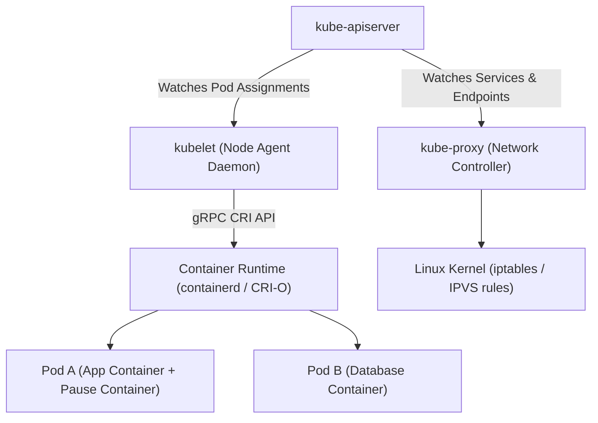
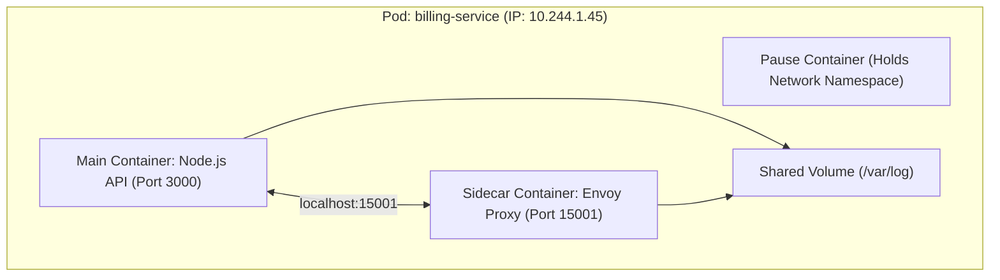
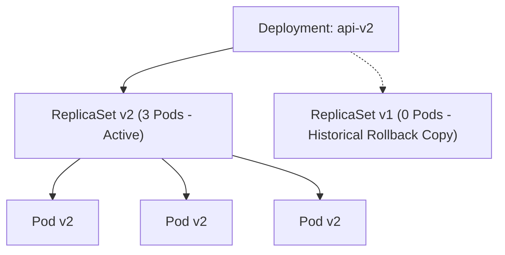
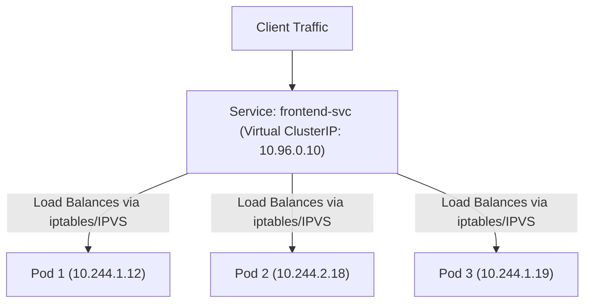
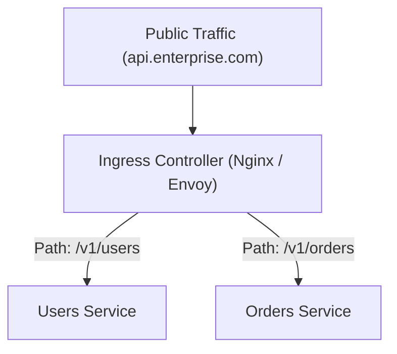
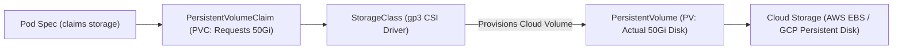
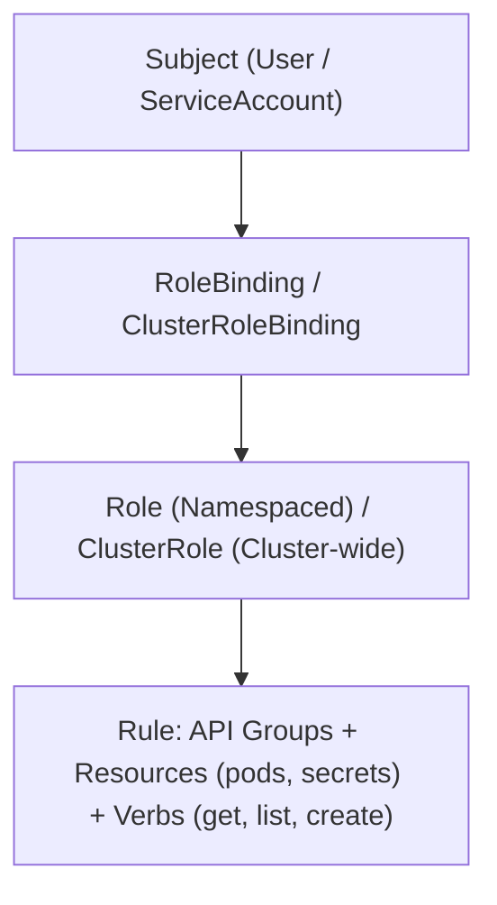
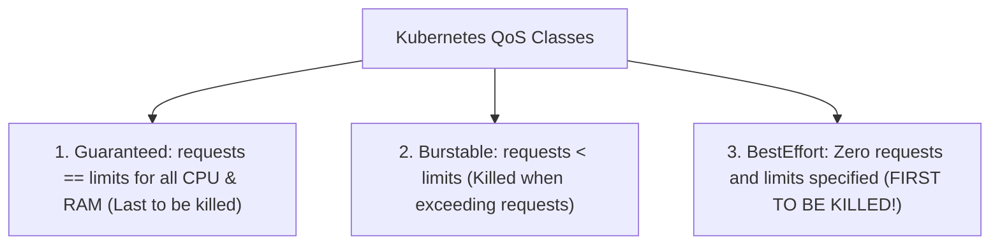

# Learn Kubernetes ☸️

<div align="center">

[](https://opensource.org/licenses/MIT)
[](https://kubernetes.io/)
[](https://nodejs.org/)
[](https://github.com/manthanank/learn-kubernetes)

**An exhaustive, production-grade masterclass from absolute zero to staff-level Platform Engineer & Certified Kubernetes Administrator (CKA/CKS).**  
Master the Kubernetes control plane architecture, pod lifecycles, workload controllers (Deployments, StatefulSets, DaemonSets), networking & Ingress/Gateway API, CSI dynamic storage, RBAC security hardening, HPA/Karpenter autoscaling, Helm packaging, and CRD Operator design.

[Getting Started](#1-stage-1-absolute-beginner-foundations--control-plane-architecture) • [Workloads & Lifecycle](#2-stage-2-core-workloads--pod-lifecycle-management) • [Networking & Ingress](#3-stage-3-networking-services--ingress-controllers) • [Storage & Config](#4-stage-4-storage-pvcpv--configuration-management) • [Security & RBAC](#5-stage-5-security-rbac--pod-security-admission) • [Autoscaling & Helm](#6-stage-6-autoscaling-observability--helm-packaging) • [Staff SRE Handbook](#7-stage-7-staff-platform-engineer--sre-interview-handbook)

<br/>

<a href="https://www.buymeacoffee.com/manthanank">
  
</a>

</div>

---

## 🗺️ 7-Stage Pedagogical Roadmap



| Stage | Focus Domain | Core Concepts & Engineering Outcomes |
| :--- | :--- | :--- |
| **Stage 1** | **Foundations & Architecture** | Control plane (`apiserver`, `etcd`, `scheduler`, `controller-manager`), Worker nodes (`kubelet`, `kube-proxy`, `containerd`), `kubectl` mastery. |
| **Stage 2** | **Workloads & Pod Lifecycle** | Pod anatomy, Multi-container patterns (Sidecar, Adapter), Probes (Startup, Liveness, Readiness), Deployments, StatefulSets, DaemonSets. |
| **Stage 3** | **Networking, Services & Ingress**| Pod-to-Pod networking (CNI), ClusterIP, NodePort, LoadBalancer, Ingress & Gateway API, NetworkPolicies (Calico/Cilium eBPF). |
| **Stage 4** | **Storage & Configuration** | Ephemeral volumes, PersistentVolumes (PV), PersistentVolumeClaims (PVC), StorageClasses (CSI), ConfigMaps, Secrets, etcd encryption. |
| **Stage 5** | **Security & RBAC** | ServiceAccounts, Roles, ClusterRoles, RoleBindings, SecurityContext, Pod Security Admission (PSA Restricted), Admission Webhooks. |
| **Stage 6** | **Autoscaling, Monitoring & Helm**| Horizontal Pod Autoscaler (HPA), Karpenter node provisioning, Resource QoS (Requests vs Limits), Prometheus ServiceMonitors, Helm Charts. |
| **Stage 7** | **Staff SRE Interview Playbook** | Troubleshooting CrashLoopBackOff/OOMKilled, CRD Operator pattern, 25 Staff Platform Engineer Q&As, `kubectl` Power Cheat Sheet. |

---

## 📋 Comprehensive Table of Contents

1. [Stage 1: Absolute Beginner Foundations & Control Plane Architecture](#1-stage-1-absolute-beginner-foundations--control-plane-architecture)
   - 1.1 [What is Kubernetes & Why Container Orchestration?](#11-what-is-kubernetes--why-container-orchestration)
   - 1.2 [The Control Plane Architecture (Master Node Components)](#12-the-control-plane-architecture-master-node-components)
   - 1.3 [The Worker Node Architecture (Kubelet, Kube-Proxy, Runtime)](#13-the-worker-node-architecture)
   - 1.4 [The Declarative Reconciliation Loop Principle](#14-the-declarative-reconciliation-loop-principle)
   - 1.5 [kubectl CLI Mastery & Output JSONPath Formatting](#15-kubectl-cli-mastery--output-jsonpath-formatting)
   - 1.6 [Line-by-Line Breakdown: Essential kubectl Commands](#16-line-by-line-breakdown-essential-kubectl-commands)
2. [Stage 2: Core Workloads & Pod Lifecycle Management](#2-stage-2-core-workloads--pod-lifecycle-management)
   - 2.1 [The Pod: Atomic Unit of Deployment & Multi-Container Patterns](#21-the-pod-atomic-unit-of-deployment--multi-container-patterns)
   - 2.2 [The Pod Lifecycle: Phases, States & Restart Policies](#22-the-pod-lifecycle-phases-states--restart-policies)
   - 2.3 [Health Probes: Startup, Liveness, and Readiness](#23-health-probes-startup-liveness-and-readiness)
   - 2.4 [Deployments: Rolling Updates, MaxSurge & MaxUnavailable](#24-deployments-rolling-updates-maxsurge--maxunavailable)
   - 2.5 [StatefulSets vs DaemonSets vs Jobs/CronJobs](#25-statefulsets-vs-daemonsets-vs-jobscronjobs)
   - 2.6 [Line-by-Line Breakdown: Production Enterprise Deployment Manifest](#26-line-by-line-breakdown-production-enterprise-deployment-manifest)
3. [Stage 3: Networking, Services & Ingress Controllers](#3-stage-3-networking-services--ingress-controllers)
   - 3.1 [The Kubernetes Networking Model & CNI Plugins](#31-the-kubernetes-networking-model--cni-plugins)
   - 3.2 [Service Abstraction: ClusterIP, NodePort, and LoadBalancer](#32-service-abstraction-clusterip-nodeport-and-loadbalancer)
   - 3.3 [kube-proxy Internals: iptables vs IPVS Mode](#33-kube-proxy-internals-iptables-vs-ipvs-mode)
   - 3.4 [Ingress Controllers & The Modern Gateway API](#34-ingress-controllers--the-modern-gateway-api)
   - 3.5 [Zero-Trust Pod Isolation: NetworkPolicies](#35-zero-trust-pod-isolation-networkpolicies)
   - 3.6 [Line-by-Line Breakdown: Default-Deny NetworkPolicy](#36-line-by-line-breakdown-default-deny-networkpolicy)
4. [Stage 4: Storage, PVC/PV & Configuration Management](#4-stage-4-storage-pvcpv--configuration-management)
   - 4.1 [Volumes vs PersistentVolumes (PV) vs PersistentVolumeClaims (PVC)](#41-volumes-vs-persistentvolumes-pv-vs-persistentvolumeclaims-pvc)
   - 4.2 [Dynamic Storage Provisioning with StorageClasses & CSI](#42-dynamic-storage-provisioning-with-storageclasses--csi)
   - 4.3 [Access Modes: RWO, ROX, RWX, and RWOP](#43-access-modes-rwo-rox-rwx-and-rwop)
   - 4.4 [ConfigMaps & Secrets: Ingestion via Volume Mounts vs Env Vars](#44-configmaps--secrets-ingestion-via-volume-mounts-vs-env-vars)
   - 4.5 [Line-by-Line Breakdown: Dynamic PVC Storage Manifest](#45-line-by-line-breakdown-dynamic-pvc-storage-manifest)
5. [Stage 5: Security, RBAC & Pod Security Admission](#5-stage-5-security-rbac--pod-security-admission)
   - 5.1 [Authentication & Projected ServiceAccount Tokens](#51-authentication--projected-serviceaccount-tokens)
   - 5.2 [Role-Based Access Control (RBAC): Roles, ClusterRoles, and Bindings](#52-role-based-access-control-rbac)
   - 5.3 [Pod Security Admission (PSA): Privileged, Baseline, and Restricted](#53-pod-security-admission-psa)
   - 5.4 [Hardening SecurityContext: Non-Root, Read-Only RootFS, Capabilities](#54-hardening-securitycontext)
   - 5.5 [Line-by-Line Breakdown: Hardened SecurityContext Spec](#55-line-by-line-breakdown-hardened-securitycontext-spec)
6. [Stage 6: Autoscaling, Observability & Helm Packaging](#6-stage-6-autoscaling-observability--helm-packaging)
   - 6.1 [Resource Management: Requests, Limits & Quality of Service (QoS)](#61-resource-management-requests-limits--quality-of-service-qos)
   - 6.2 [Horizontal Pod Autoscaler (HPA v2) & Karpenter Node Scaling](#62-horizontal-pod-autoscaler-hpa-v2--karpenter-node-scaling)
   - 6.3 [Cluster Observability: Prometheus Operator & ServiceMonitors](#63-cluster-observability-prometheus-operator--servicemonitors)
   - 6.4 [Helm Package Management: Templates, Values, and Chart Architecture](#64-helm-package-management-templates-values-and-chart-architecture)
   - 6.5 [Line-by-Line Breakdown: Production HPA Manifest](#65-line-by-line-breakdown-production-hpa-manifest)
7. [Stage 7: Staff Platform Engineer & SRE Interview Handbook](#7-stage-7-staff-platform-engineer--sre-interview-handbook)
   - 7.1 [Production Incident Troubleshooting Runbook](#71-production-incident-troubleshooting-runbook)
   - 7.2 [Custom Resource Definitions (CRD) & The Operator Pattern](#72-custom-resource-definitions-crd--the-operator-pattern)
   - 7.3 [25 Staff Platform Engineer & SRE Interview Q&As](#73-25-staff-platform-engineer--sre-interview-qas)
   - 7.4 [The Ultimate SRE kubectl Power Cheat Sheet](#74-the-ultimate-sre-kubectl-power-cheat-sheet)


---

## 1. Stage 1: Absolute Beginner Foundations & Control Plane Architecture

### 1.1 What is Kubernetes & Why Container Orchestration?
**Kubernetes (K8s)** is an open-source container orchestration engine originally designed by Google (based on internal systems Borg and Omega) and maintained by the Cloud Native Computing Foundation (CNCF).
Running containers via standalone Docker works for single servers, but in large-scale production environments:
- What happens when a physical server crashes at 3:00 AM?
- How do you update an application across 500 instances with zero downtime?
- How do microservices discover each other dynamically as IP addresses change constantly?
- How do you autoscale from 5 to 500 instances when traffic spikes 10x?

Kubernetes solves this by abstracting a fleet of bare-metal machines or cloud virtual machines into a **single unified distributed computing cluster**.

---

### 1.2 The Control Plane Architecture (Master Node Components)
The Control Plane is the brain of the Kubernetes cluster, making global scheduling decisions, responding to cluster events, and persisting cluster state.

```mermaid
flowchart TD
    Admin["kubectl / CI/CD"] -->|HTTPS REST API (Port 6443)| APIServer["kube-apiserver (API Gateway & Validator)"]
    
    subgraph ControlPlane["Kubernetes Control Plane"]
        APIServer <--> ETCD["etcd (Distributed Key-Value Store)"]
        APIServer <--> Scheduler["kube-scheduler (Placement Engine)"]
        APIServer <--> KCM["kube-controller-manager (Reconciliation Loops)"]
        APIServer <--> CCM["cloud-controller-manager (AWS/GCP/Azure)"]
    end

    APIServer <-->|HTTPS Worker Agent| KubeletNode1["Node 1: kubelet"]
    APIServer <-->|HTTPS Worker Agent| KubeletNode2["Node 2: kubelet"]
```

| Component | Port | Technical Function & Operational Role |
| :--- | :---: | :--- |
| **`kube-apiserver`** | `6443` | The front door of the control plane. Exposes the Kubernetes HTTP REST API, authenticates clients, enforces admission controls, and is the **only component that directly reads or writes to `etcd`**. |
| **`etcd`** | `2379 / 2380` | Consistent, highly-available, distributed key-value store (using the Raft consensus algorithm). Persists the entire state and configuration specifications of the cluster. |
| **`kube-scheduler`** | `10259` | Assigns unscheduled pods to optimal worker nodes. Evaluates node requirements using two phases: **Filtering (Predicates)** (e.g. node capacity, taints) and **Scoring (Priorities)** (e.g. image locality, resource spread). |
| **`kube-controller-manager`** | `10257` | Runs continuous background control loops (Node Controller, Deployment Controller, EndpointSlice Controller, ServiceAccount Controller). Continuously compares current state with desired state. |
| **`cloud-controller-manager`** | `10258` | Integrates with underlying cloud provider APIs to provision cloud load balancers, manage cloud storage volumes, and configure VPC routes. |

---

### 1.3 The Worker Node Architecture
Worker nodes run the containerized application workloads assigned to them:



- **`kubelet`**: The primary node agent running on every worker node. Communicates with `kube-apiserver`, mounts storage volumes, downloads image secrets, instructs the container runtime via the **Container Runtime Interface (CRI)** to run containers, and reports node health.
- **`kube-proxy`**: Network proxy running on each node. Watches Service and EndpointSlice objects via `kube-apiserver` and configures local OS packet filtering (`iptables` or `IPVS`) to load-balance traffic across Pod IPs.
- **Container Runtime**: Software that executes containers (e.g., `containerd`, CRI-O). Implements the OCI (Open Container Initiative) runtime specification.

---

### 1.4 The Declarative Reconciliation Loop Principle
Unlike imperative scripting (`"start 3 containers now"`), Kubernetes operates strictly on **Declarative State**:

```text
       ┌───────────────────────────────┐
       │   Observe Current State       │
       └──────────────┬────────────────┘
                      │
                      ▼
       ┌───────────────────────────────┐
       │   Analyze Differences (Delta) │
       └──────────────┬────────────────┘
                      │
                      ▼
       ┌───────────────────────────────┐
       │   Act to Reconcile Differences│
       └──────────────┬────────────────┘
                      │
                      └───────► (Repeat Every Few Milliseconds)
```

1. You submit a YAML manifest declaring: `"I want 3 replicas of the frontend"`.
2. The Deployment controller queries `kube-apiserver` and observes only 2 pods are running.
3. The delta is $+1$. The controller sends a pod creation request to `kube-apiserver`.
4. The scheduler picks a node; `kubelet` pulls the image and starts the container.
5. If a physical node catches fire, the controller detects 2 replicas running, and immediately spawns a replacement on a healthy node.

---

### 1.5 kubectl CLI Mastery & Output JSONPath Formatting
The command-line tool `kubectl` communicates with the cluster's `kube-apiserver`:

```bash
# Set default namespace context
kubectl config set-context --current --namespace=production

# View all pods across all namespaces with node IP assignments
kubectl get pods -A -o wide

# Extract specific JSON fields using JSONPath (e.g. get all Pod IPs)
kubectl get pods -l app=frontend -o jsonpath='{.items[*].status.podIP}'

# Stream real-time container logs with timestamps
kubectl logs -f deployment/api-server -c backend --timestamps=true

# Execute interactive shell inside running container
kubectl exec -it pod/api-server-7b49cf568b-x2k4j -c backend -- /bin/sh
```

---

### 1.6 Line-by-Line Breakdown: Essential kubectl Commands

| Command / Flag | Purpose | Technical Runtime Behavior |
| :--- | :--- | :--- |
| `kubectl apply -f manifest.yaml` | **Declarative State Sync** | Calculates 3-way merge patch between local YAML, live cluster state, and `last-applied-configuration` annotation. |
| `kubectl get pods -o wide` | **Node & IP Inspection** | Appends Pod IP, host node name, and readiness status without querying raw JSON. |
| `kubectl describe pod <name>` | **Deep Event Diagnostics** | Shows Pod conditions, mounted volumes, container states, and chronological kernel/kubelet event logs (vital for debugging). |
| `kubectl top nodes` | **Resource Monitoring** | Queries `metrics-server` to output real-time CPU (millicores) and RAM (MiB) utilization per node. |
| `kubectl rollout undo deploy/<name>`| **Instant Rollback** | Reverts Deployment spec to the previous Revision recorded in `deployment.kubernetes.io/revision`. |


---

## 2. Stage 2: Core Workloads & Pod Lifecycle Management

### 2.1 The Pod: Atomic Unit of Deployment & Multi-Container Patterns
A **Pod** is the smallest deployable computing unit in Kubernetes. A pod encapsulates:
1. One or more tightly coupled application containers.
2. Shared Linux network namespace (all containers in a pod share the **exact same IP address** and port space via `localhost`).
3. Shared Linux IPC namespace and shared storage volumes.



#### The 3 Classical Multi-Container Patterns
- **Sidecar Pattern**: Enhances or augments the primary container (e.g., Envoy proxy for service mesh, Fluent-bit log shipper).
- **Ambassador Pattern**: Proxies communication to the outside world (e.g., local Redis proxy that handles cluster sharding logic).
- **Adapter Pattern**: Standardizes heterogeneous application outputs (e.g., reformatting custom monitoring output into Prometheus metrics format).

---

### 2.2 The Pod Lifecycle: Phases, States & Restart Policies
A Pod transitions through well-defined phases:
- **`Pending`**: Pod accepted by `apiserver`, but one or more containers have not been created (e.g. waiting to be scheduled, downloading images).
- **`Running`**: Bound to a node; all containers created; at least one container is currently executing or restarting.
- **`Succeeded`**: All containers terminated successfully (exit code 0); will not be restarted (typical for Jobs).
- **`Failed`**: All containers terminated; at least one container terminated in failure (non-zero exit code).
- **`Unknown`**: State cannot be obtained, typically due to network disconnection between control plane and `kubelet`.

---

### 2.3 Health Probes: Startup, Liveness, and Readiness
`kubelet` monitors container health using three distinct probe types:

```mermaid
flowchart LR
    Start["Container Starts"] --> Startup{"1. Startup Probe Passing?"}
    Startup -->|No (Timeout)| Kill1["Restart Container"]
    Startup -->|Yes| Active["App Initialized"]
    Active --> Live{"2. Liveness Probe"}
    Active --> Ready{"3. Readiness Probe"}
    Live -->|Fails| Kill2["Kills & Restarts Container"]
    Ready -->|Fails| RemoveEndpoint["Removes Pod IP from Service Endpoints (Zero Traffic)"]
    Ready -->|Passes| AddEndpoint["Routes Traffic to Pod"]
```

| Probe Type | Failure Action | Operational Purpose |
| :--- | :--- | :--- |
| **`startupProbe`** | Kills and restarts container. | Disables liveness/readiness checks during slow application boots (e.g. legacy Java apps taking 90s to load). |
| **`livenessProbe`** | Kills container and initiates restart policy. | Detects deadlocks, infinite loops, or frozen processes where process is running but cannot make progress. |
| **`readinessProbe`** | **Does NOT restart container**. Drops Pod IP from Service routing endpoints. | Detects temporary unreadiness (e.g. loading heavy cache, warming JIT, database reconnection). Prevents 502 Bad Gateway errors! |

---

### 2.4 Deployments: Rolling Updates & Zero-Downtime Releases
A Deployment manages **ReplicaSets**, which in turn manage individual Pods:



#### RollingUpdate Strategy Parameters
- **`maxSurge`**: The maximum number of Pods that can be created above the desired replica count (e.g. `25%`).
- **`maxUnavailable`**: The maximum number of Pods that can be unavailable during the update process (e.g. `0%` guarantees zero capacity reduction during deployments).

---

### 2.5 StatefulSets vs DaemonSets vs Jobs

| Workload Type | Unique Identifier | Storage Relationship | Real-World Production Use Case |
| :--- | :--- | :--- | :--- |
| **Deployment** | Ephemeral random hash (`web-7b49cf-x2k4j`). | Shared or stateless. | Stateless web apps, REST APIs, microservices. |
| **StatefulSet** | Stable ordinal index (`kafka-0`, `kafka-1`). | Dedicated PVC per ordinal. | Distributed databases, ZooKeeper, Kafka, PostgreSQL primary-replica. |
| **DaemonSet** | One pod per matched node. | Node-local storage. | Log collectors (`fluent-bit`), monitoring (`node-exporter`), CNI (`calico`). |
| **Job / CronJob**| Runs to completion (exit code 0). | Ephemeral. | Database schema migrations, nightly backup snapshots, ML batch inference. |

---

### 2.6 Line-by-Line Breakdown: Production Enterprise Deployment Manifest

```yaml
apiVersion: apps/v1
kind: Deployment
metadata:
  name: ecommerce-api
  namespace: production
  labels:
    app.kubernetes.io/name: ecommerce-api
    app.kubernetes.io/part-of: ecommerce-platform
spec:
  replicas: 3
  revisionHistoryLimit: 5
  strategy:
    type: RollingUpdate
    rollingUpdate:
      maxSurge: 1
      maxUnavailable: 0
  selector:
    matchLabels:
      app: ecommerce-api
  template:
    metadata:
      labels:
        app: ecommerce-api
    spec:
      containers:
      - name: api
        image: registry.internal.company/ecommerce-api:v2.4.1
        imagePullPolicy: IfNotPresent
        ports:
        - containerPort: 8080
          name: http
        resources:
          requests:
            cpu: "250m"
            memory: "512Mi"
          limits:
            cpu: "1000m"
            memory: "1Gi"
        startupProbe:
          httpGet:
            path: /healthz/startup
            port: 8080
          failureThreshold: 30
          periodSeconds: 2
        livenessProbe:
          httpGet:
            path: /healthz/liveness
            port: 8080
          initialDelaySeconds: 5
          periodSeconds: 10
        readinessProbe:
          httpGet:
            path: /healthz/readiness
            port: 8080
          initialDelaySeconds: 5
          periodSeconds: 5
```

| YAML Directive | Technical Purpose | SRE & Resilience Guarantee |
| :--- | :--- | :--- |
| `revisionHistoryLimit: 5` | Storage Pruning | Retains only 5 previous ReplicaSets in etcd to prevent cluster metadata bloat. |
| `maxUnavailable: 0` | Zero Downtime | Guarantees cluster maintains 100% of required serving capacity during upgrades. |
| `resources.requests` | Node Scheduling | Scheduler uses CPU (`250m` = 0.25 core) and RAM (`512Mi`) to guarantee capacity on host node. |
| `resources.limits` | Hard Ceilings | Enforces cgroups limit; if memory exceeds `1Gi`, container is terminated with **OOMKilled**. |
| `startupProbe` | Slow Boot Defense | Allows up to $30 \times 2\text{s} = 60\text{s}$ for initial startup before liveness probe takes over. |


---

## 3. Stage 3: Networking, Services & Ingress Controllers

### 3.1 The Kubernetes Networking Model & CNI Plugins
Kubernetes imposes four fundamental networking mandates:
1. All Pods can communicate with all other Pods on any node **without Network Address Translation (NAT)**.
2. Agents on a node (e.g. `kubelet`) can communicate with all Pods on that same node.
3. Pods on the host network can communicate with all Pods on all nodes.
4. Every Pod receives its own unique routable IP address from the cluster Pod CIDR (`10.244.0.0/16`).

#### Container Network Interface (CNI)
Kubernetes offloads network plumbing to CNI plugins:
- **Calico**: High-performance IP-in-IP or BGP routing with fine-grained NetworkPolicy enforcement.
- **Cilium**: Modern, ultra-high-throughput networking using Linux **eBPF** instead of iptables, supporting Layer 7 API-aware security policies.
- **Flannel**: Lightweight VXLAN overlay network for simple development clusters.

---

### 3.2 Service Abstraction: ClusterIP, NodePort, and LoadBalancer
Because Pods are ephemeral and their IP addresses change every time they recreate, **Services** provide a stable, persistent IP address and DNS name:



| Service Type | Scope & Accessibility | Technical Implementation |
| :--- | :--- | :--- |
| **`ClusterIP`** (Default) | Internal to cluster only. | Assigns stable virtual IP from Service CIDR. Resolvable via CoreDNS (`frontend.production.svc.cluster.local`). |
| **`NodePort`** | Accessible externally via Node IP. | Allocates dedicated high port across every worker node (`30000-32767`). Traffic hitting any node port forwards to Service. |
| **`LoadBalancer`** | Public internet facing. | Calls cloud provider API (AWS NLB/ALB, GCP Cloud LB) to provision an external public IP routing into NodePorts. |
| **`ExternalName`** | Internal DNS CNAME redirect. | Returns CNAME record (e.g. `my-db.rds.amazonaws.com`) without proxying traffic. |

---

### 3.3 kube-proxy Internals: iptables vs IPVS Mode
- **`iptables` Mode**: `kube-proxy` writes deterministic Netfilter chains. Sequential evaluation is $O(N)$ with respect to total cluster services. In clusters with 5,000+ services, iptables rule updates stall the node CPU.
- **`IPVS` (IP Virtual Server) Mode**: Implemented inside the Linux kernel using hash tables with $O(1)$ routing complexity. Supports advanced load balancing algorithms: Weighted Round-Robin, Least Connections, Locality-Based.

---

### 3.4 Ingress Controllers & The Modern Gateway API
A `LoadBalancer` service provisions an expensive cloud load balancer per service. **Ingress** consolidates routing for hundreds of services behind a single load balancer:



#### Gateway API (Next-Generation Standard)
The modern replacement for Ingress splits responsibilities by role:
- **`GatewayClass`** (Infra Provider): Declares controller implementation (AWS ALB, Cilium, Istio).
- **`Gateway`** (Cluster Admin): Defines listening ports (80, 443) and TLS certificates.
- **`HTTPRoute`** (App Developer): Defines application path routing rules, header rewrites, and traffic splitting (canary releases).

---

### 3.5 Zero-Trust Pod Isolation: NetworkPolicies
By default, Kubernetes network is an **open flat network**: any Pod can talk to any other Pod, including sensitive database pods!
**NetworkPolicies** enforce packet filtering rules at the Pod network interface (Layer 3/4):

```yaml
apiVersion: networking.k8s.io/v1
kind: NetworkPolicy
metadata:
  name: secure-database-access
  namespace: production
spec:
  podSelector:
    matchLabels:
      role: database
  policyTypes:
  - Ingress
  ingress:
  - from:
    - podSelector:
        matchLabels:
          role: backend-api
    ports:
    - protocol: TCP
      port: 5432
```
- **Operational Rule**: Pods with label `role: database` accept incoming TCP connections on port 5432 **strictly from pods bearing the label `role: backend-api`**. All other incoming traffic is rejected by the CNI!


---


---

### 3.7 The Modern Gateway API: Gateway & HTTPRoute Manifests

```yaml
# 1. Define the Gateway listener endpoint
apiVersion: gateway.networking.k8s.io/v1
kind: Gateway
metadata:
  name: enterprise-gateway
  namespace: production
spec:
  gatewayClassName: cilium-gateway
  listeners:
  - name: https
    protocol: HTTPS
    port: 443
    tls:
      mode: Terminate
      certificateRefs:
      - name: enterprise-tls-cert
    allowedRoutes:
      namespaces:
        from: All

---
# 2. Define HTTPRoute with 90/10 Canary Traffic Splitting
apiVersion: gateway.networking.k8s.io/v1
kind: HTTPRoute
metadata:
  name: api-routing
  namespace: production
spec:
  parentRefs:
  - name: enterprise-gateway
  hostnames:
  - "api.enterprise.internal"
  rules:
  - matches:
    - path:
        type: PathPrefix
        value: /v1/orders
    backendRefs:
    - name: orders-service-v1
      port: 8080
      weight: 90
    - name: orders-service-v2-canary
      port: 8080
      weight: 10
```

| Gateway API Field | Role | Architectural Advantage |
| :--- | :--- | :--- |
| `gatewayClassName: cilium` | Infra Binding | Decouples route rules from physical controller implementation. |
| `tls.mode: Terminate` | Crypto Offload | Hardware-accelerated TLS termination at cluster perimeter. |
| `weight: 90 / weight: 10`| Canary Routing | Native traffic splitting at Layer 7 without complex service mesh overlays. |
| `parentRefs` | Security Boundary | Developers attach routes to gateways without having admin rights to the gateway itself. |


## 4. Stage 4: Storage, PVC/PV & Configuration Management

### 4.1 Volumes vs PersistentVolumes (PV) vs PersistentVolumeClaims (PVC)
To prevent data loss when containers restart or pods reschedule onto different nodes, Kubernetes separates storage abstractions:



- **`PersistentVolume` (PV)**: A piece of actual storage in the cluster provisioned by an administrator or dynamically provisioned via StorageClass.
- **`PersistentVolumeClaim` (PVC)**: A request for storage by an application developer (specifying size e.g. `50Gi` and access mode).

---

### 4.2 Storage Access Modes
| Access Mode | CLI Abbr | Physical Capability | Typical Underlying Storage Backend |
| :--- | :---: | :--- | :--- |
| **ReadWriteOnce** | `RWO` | Mounted as read-write by a **single node**. | Block storage: AWS EBS, GCP PD, Azure Disk. |
| **ReadOnlyMany** | `ROX` | Mounted as read-only by **many nodes** simultaneously. | File storage: AWS EFS, NFS shares. |
| **ReadWriteMany** | `RWX` | Mounted as read-write by **many nodes** simultaneously. | Shared Distributed File: AWS EFS, CephFS, GlusterFS. |
| **ReadWriteOncePod**| `RWOP` | Mounted as read-write by a **single Pod** (K8s 1.22+). | Guarantees absolute single-pod isolation on block storage. |

---

### 4.3 ConfigMaps & Secrets Management
- **ConfigMaps**: Stores non-confidential configuration in key-value pairs (`DATABASE_HOST`, `LOG_LEVEL`).
- **Secrets**: Stores sensitive data (`tokens`, `passwords`, `tls.key`) encoded in Base64.
  - *Caution*: Base64 is **NOT encryption**! Production clusters must enable **etcd Encryption at Rest** via `EncryptionConfiguration` using KMS providers (AWS KMS, HashiCorp Vault).


---


---

### 4.6 StatefulSet Dynamic Volume Claim Templates (PostgreSQL Cluster)

```yaml
apiVersion: apps/v1
kind: StatefulSet
metadata:
  name: postgres-ha
  namespace: database
spec:
  serviceName: postgres-headless
  replicas: 3
  selector:
    matchLabels:
      app: postgres-ha
  template:
    metadata:
      labels:
        app: postgres-ha
    spec:
      containers:
      - name: postgres
        image: postgres:16-alpine
        ports:
        - containerPort: 5432
          name: postgres
        volumeMounts:
        - name: pgdata
          mountPath: /var/lib/postgresql/data
  volumeClaimTemplates:
  - metadata:
      name: pgdata
    spec:
      accessModes: [ "ReadWriteOnce" ]
      storageClassName: "gp3-encrypted"
      resources:
        requests:
          storage: 100Gi
```

| StatefulSet Storage Element | Behavior | SRE Guarantee |
| :--- | :--- | :--- |
| `volumeClaimTemplates` | Auto PVC Generation | Automatically creates `pgdata-postgres-ha-0`, `pgdata-postgres-ha-1`, `pgdata-postgres-ha-2`. |
| Dedicated PVC per Ordinal | Pod-Storage Affiliation | When `postgres-ha-1` restarts or migrates nodes, it re-attaches to its exact original 100Gi disk. |
| `serviceName: headless` | Direct Pod DNS | Creates deterministic DNS records (`postgres-ha-0.postgres-headless.database.svc.cluster.local`). |


## 5. Stage 5: Security, RBAC & Pod Security Admission

### 5.1 Role-Based Access Control (RBAC) Architecture
RBAC restricts what actions users and ServiceAccounts can perform on cluster resources:



```yaml
# 1. Define Namespaced Role
apiVersion: rbac.authorization.k8s.io/v1
kind: Role
metadata:
  namespace: staging
  name: pod-reader
rules:
- apiGroups: [""] # Core API group
  resources: ["pods", "pods/log"]
  verbs: ["get", "list", "watch"]

---
# 2. Bind Role to Developer ServiceAccount
apiVersion: rbac.authorization.k8s.io/v1
kind: RoleBinding
metadata:
  name: read-pods-binding
  namespace: staging
subjects:
- kind: User
  name: alex@company.internal
  apiGroup: rbac.authorization.k8s.io
roleRef:
  kind: Role
  name: pod-reader
  apiGroup: rbac.authorization.k8s.io
```

---

### 5.2 Pod Security Standards (PSS) & Admission (PSA)
Replaces deprecated PodSecurityPolicies (PSP) with built-in namespace-level labels:

| PSS Profile | Level of Enforcement | Allowed Capabilities |
| :--- | :--- | :--- |
| **`Privileged`** | Unrestricted | Container has root access, host namespaces, raw device access. |
| **`Baseline`** | Minimal restrictions | Prevents known privilege escalation; allows default container settings. |
| **`Restricted`** | **Enterprise Hardened** | Requires non-root execution, drops all Linux capabilities, read-only root filesystems. |

```bash
# Enforce Restricted profile on a namespace:
kubectl label --overwrite ns production \
  pod-security.kubernetes.io/enforce=restricted \
  pod-security.kubernetes.io/enforce-version=latest
```

---

### 5.3 Hardening SecurityContext at Container Level
```yaml
securityContext:
  allowPrivilegeEscalation: false
  runAsNonRoot: true
  runAsUser: 10001
  runAsGroup: 10001
  readOnlyRootFilesystem: true
  capabilities:
    drop:
    - ALL
```
- **`allowPrivilegeEscalation: false`**: Prevents binary `setuid` bit from granting root privileges inside container.
- **`runAsNonRoot: true`**: `kubelet` actively verifies container UID is not 0; rejects pod if UID is root.
- **`readOnlyRootFilesystem: true`**: Prevents attackers from writing malware or mutating binaries in container OS directories.
- **`drop: ["ALL"]`**: Strips all 38+ default Linux capabilities (e.g. `CAP_SYS_ADMIN`, `CAP_NET_RAW`).


---

## 6. Stage 6: Autoscaling, Observability & Helm Packaging

### 6.1 Quality of Service (QoS) Classes
When node memory is exhausted, the Linux Out-Of-Memory (OOM) killer selects pods to terminate based on their QoS class:



---

### 6.2 Horizontal Pod Autoscaler (HPA v2) & Karpenter
- **HPA**: Adjusts replica counts dynamically based on CPU, memory, or custom metrics (e.g. RabbitMQ queue depth).
- **Karpenter**: High-performance, just-in-time node provisioner (surpassing legacy Cluster Autoscaler). Observes pending pods and launches right-sized EC2 instances directly via cloud APIs in $<40\text{ seconds}$, skipping node-group overhead.

```yaml
apiVersion: autoscaling/v2
kind: HorizontalPodAutoscaler
metadata:
  name: api-autoscaler
  namespace: production
spec:
  scaleTargetRef:
    apiVersion: apps/v1
    kind: Deployment
    name: ecommerce-api
  minReplicas: 3
  maxReplicas: 30
  metrics:
  - type: Resource
    resource:
      name: cpu
      target:
        type: Utilization
        averageUtilization: 70
```

---

### 6.3 Helm Package Management Architecture
Helm is the de-facto package manager for Kubernetes:

```text
mychart/
├── Chart.yaml          # Metadata (name, version, appVersion)
├── values.yaml         # Default user-overridable configuration variables
├── templates/          # Go-templated Kubernetes YAML manifests
│   ├── deployment.yaml
│   ├── service.yaml
│   └── ingress.yaml
└── templates/_helpers.tpl # Reusable template definition partials
```

```bash
# Package, lint, and deploy a Helm release with custom values
helm lint ./mychart
helm upgrade --install payment-svc ./mychart --namespace production --values prod-values.yaml
```


---


---

### 6.6 Cluster Observability: Prometheus Operator ServiceMonitor

```yaml
apiVersion: monitoring.coreos.com/v1
kind: ServiceMonitor
metadata:
  name: ecommerce-api-monitor
  namespace: production
  labels:
    release: prometheus-stack
spec:
  selector:
    matchLabels:
      app: ecommerce-api
  endpoints:
  - port: http
    path: /metrics
    interval: 15s
    scrapeTimeout: 10s
    metricRelabelings:
    - sourceLabels: [__name__]
      regex: "(http_requests_total|http_request_duration_seconds.*)"
      action: keep
```

| ServiceMonitor Field | Technical Function | Production Observability Impact |
| :--- | :--- | :--- |
| `selector.matchLabels` | Dynamic Discovery | Prometheus dynamically discovers new Pod endpoints matching labels without configuration reloads. |
| `interval: 15s` | Scrape Frequency | High-resolution metrics collection matching Golden Signals (Latency, Traffic, Errors, Saturation). |
| `metricRelabelings` | Metric Pruning | Drops unwanted cardinality metrics before ingestion to prevent Prometheus memory exhaustion. |


## 7. Stage 7: Staff Platform Engineer & SRE Interview Handbook

### 7.1 Production Incident Troubleshooting Runbook

```mermaid
flowchart TD
    Issue["Pod Issue Reported"] --> CheckStatus{"kubectl get pod"}
    CheckStatus -->|CrashLoopBackOff| Logs["kubectl logs <pod> --previous"]
    CheckStatus -->|Pending| Events["kubectl describe pod <pod> (Look for Insufficient CPU/Memory/Taints)"]
    CheckStatus -->|ImagePullBackOff| Secret["Verify Image Tag, Registry DNS & imagePullSecrets"]
    CheckStatus -->|OOMKilled (Exit Code 137)| Memory["Increase resources.limits.memory"]
    CheckStatus -->|Running but No Traffic| Probes["Check readinessProbe & Service selector labels"]
```

---

### 7.2 Custom Resource Definitions (CRD) & The Operator Pattern
The Operator pattern extends Kubernetes to automate complex stateful application lifecycles (backups, failover, upgrades):
1. **Custom Resource Definition (CRD)**: Defines a new Kubernetes object type (e.g. `kind: PostgresCluster`).
2. **Custom Controller**: Runs an active reconciliation loop written in Go (using `controller-runtime` or Kubebuilder) that watches CRD instances and orchestrates standard Pods, Services, and Backups automatically.

---

### 7.3 25 Staff Platform Engineer & SRE Interview Q&As

#### Q1: What happens under the hood when a user executes `kubectl run nginx --image=nginx`?
**Answer:** 
1. `kubectl` validates the command, parses client-side flags, and sends an HTTP POST request to `kube-apiserver` (port 6443).
2. `kube-apiserver` authenticates the user (via TLS cert, bearer token, or OIDC) and authorizes the request via RBAC.
3. Request passes through **Mutating Admission Webhooks** (e.g. injecting sidecars, default storage classes) and **Validating Admission Webhooks**.
4. The Pod object is written to `etcd` storage. `apiserver` returns success to `kubectl`.
5. **`kube-scheduler`** detects the new unassigned pod (`spec.nodeName` is empty) via watch stream. It executes Filtering (predicates) and Scoring (priorities) and assigns the pod to a healthy worker node, writing the binding back to `apiserver`.
6. The **`kubelet`** on the selected worker node watches `apiserver` and notices a pod assigned to it.
7. `kubelet` invokes the Container Runtime Interface (CRI) over gRPC to pull the image and create the container sandbox.
8. `kubelet` invokes the Container Network Interface (CNI) to allocate a Pod IP and configure network namespaces.
9. `kubelet` invokes the Container Storage Interface (CSI) to mount required volumes.
10. Container starts, and `kubelet` reports Pod status `Running` back to `kube-apiserver`.

#### Q2: What is the purpose of the `pause` container in a Pod?
**Answer:** The `pause` container (also known as the infrastructure container) is the very first container launched when a Pod is created. Its sole responsibility is to hold open the Linux namespaces (Network, IPC, UTS) that define the Pod's shared execution environment. All other user-defined containers in the Pod join the namespaces held by the `pause` container. If an application container crashes and restarts, the network IP and port bindings remain intact because the `pause` container never exited.

#### Q3: What is the difference between `requests` and `limits` for CPU and Memory?
**Answer:** 
- **Requests**: Used exclusively by `kube-scheduler` to find a node with enough capacity to run the Pod. The node guarantees this allocation will be physically available to the container.
- **Limits**: Enforced at runtime by the Linux kernel via control groups (`cgroups`).
  - For **CPU**: CPU is a compressible resource. If a container reaches its limit, the kernel Completely Fair Scheduler (CFS) throttles CPU cycles (`cfs_quota_us`), slowing the app down without killing it.
  - For **Memory**: Memory is incompressible. If a container exceeds its memory limit, the Linux kernel Out-Of-Memory (OOM) killer terminates the process immediately with **Exit Code 137 (`OOMKilled`)**.

#### Q4: Why does a Pod enter `CrashLoopBackOff` and how do you diagnose it?
**Answer:** `CrashLoopBackOff` indicates that a container repeatedly starts, fails, and crashes, triggering `kubelet` to restart it with an exponential backoff delay (10s, 20s, 40s... up to 5 minutes). Diagnosis:
1. Run `kubectl logs <pod-name> --previous` to inspect the stdout/stderr logs of the container instance *right before* it crashed.
2. Run `kubectl describe pod <pod-name>` and inspect the `Exit Code` in the Last State section (e.g. Exit 1 = application runtime crash, Exit 137 = OOM kill, Exit 139 = segmentation fault).
3. Verify environment variables and missing ConfigMaps or Secrets.

#### Q5: How does `etcd` maintain cluster consistency, and why should etcd clusters have an odd number of members?
**Answer:** `etcd` uses the **Raft consensus algorithm** to achieve distributed consensus on cluster state. To commit a write, a strict majority quorum is required:
$$\text{Quorum} = \left\lfloor \frac{N}{2} \right\rfloor + 1$$
An odd number of nodes (3, 5) maximizes fault tolerance at minimal cost:
- A 3-node cluster tolerates 1 failure (Quorum = 2).
- A 4-node cluster also tolerates only 1 failure (Quorum = 3), while adding network communication overhead without increasing resilience.
- Therefore, production clusters always use 3 or 5 etcd nodes.

#### Q6: Explain the difference between `ClusterIP`, `NodePort`, and `LoadBalancer` services.
**Answer:** 
- `ClusterIP`: Allocates an internal-only virtual IP address. Reachable only within the cluster; used for inter-service communication.
- `NodePort`: Builds on ClusterIP by opening an identical port (30000–32767) across every physical worker node in the cluster. External traffic sent to `<Any-Node-IP>:<NodePort>` is forwarded to the service.
- `LoadBalancer`: Builds on NodePort by invoking cloud provider APIs (AWS/GCP/Azure) to provision a dedicated cloud load balancer that routes external internet traffic to the cluster NodePorts.

#### Q7: What is the difference between a `Headless Service` and a standard `ClusterIP` service?
**Answer:** A standard `ClusterIP` service has a virtual IP (`spec.clusterIP`) assigned to it; CoreDNS returns that single virtual IP, and `kube-proxy` load-balances requests across pods. A **Headless Service** sets `clusterIP: None`. CoreDNS does NOT return a virtual IP; instead, it returns direct DNS `A` records for **all individual healthy Pod IPs**. This is mandatory for StatefulSets (like Cassandra or MongoDB) where clients must connect directly to specific master or replica nodes.

#### Q8: How does the Gateway API improve upon the legacy Ingress resource?
**Answer:** Legacy Ingress tried to cram all routing concerns into a single monolithic manifest managed by one role, relying on vendor-specific annotations (e.g. `nginx.ingress.kubernetes.io/rewrite-target`) that broke cross-platform portability. The **Gateway API** introduces an expressive, role-oriented standard:
1. `GatewayClass` (Infra provider defines capabilities).
2. `Gateway` (Cluster operators define network endpoints and TLS).
3. `HTTPRoute` / `GRPCRoute` (Application developers define paths, headers, and traffic splitting).
It provides native support for cross-namespace routing, canary deployments, and Layer 7 protocol matching without custom annotations.

#### Q9: What happens when a worker node becomes `NotReady`?
**Answer:** 
1. `kubelet` stops posting node status heartbeats to `kube-apiserver`.
2. After `node-monitor-grace-period` (default 40s), the Node Controller flags the node as `NotReady`.
3. If the node remains `NotReady` past `pod-eviction-timeout` (default 5 minutes), the controller marks all pods on that node for deletion and schedules replacement pods onto healthy worker nodes.
4. If pods are part of a StatefulSet with RWO volumes, pods will get stuck in `Terminating` until the dead node is forced-deleted or recovered, to prevent multi-writer disk corruption.

#### Q10: What are Taints, Tolerations, and Node Affinity?
**Answer:** 
- **Taints**: Applied to **Nodes** to *repel* pods (`kubectl taint nodes node1 gpu=true:NoSchedule`). Unless a pod has a matching toleration, it will not be scheduled on that node.
- **Tolerations**: Applied to **Pods** to allow them to schedule onto tainted nodes.
- **Node Affinity**: Applied to **Pods** to *attract* them to specific nodes based on node labels (e.g. `topology.kubernetes.io/zone=us-east-1a`). Can be hard (`requiredDuringSchedulingIgnoredDuringExecution`) or soft (`preferredDuringSchedulingIgnoredDuringExecution`).

#### Q11: Explain how CoreDNS resolves service names inside a Kubernetes cluster.
**Answer:** When a pod performs a DNS query for `billing-service`:
1. The Pod's `/etc/resolv.conf` contains search domains:
   - `<namespace>.svc.cluster.local`
   - `svc.cluster.local`
   - `cluster.local`
2. The query expands sequentially to `billing-service.<namespace>.svc.cluster.local`.
3. CoreDNS matches the service record and returns the virtual ClusterIP.
4. For cross-namespace communication, pods must query `<service>.<target-namespace>.svc.cluster.local`.

#### Q12: How do you gracefully shut down a Pod with zero dropped HTTP requests?
**Answer:** 
1. `kube-apiserver` marks the Pod status as `Terminating`.
2. Simultaneously, two independent actions occur:
   - Endpoint Controller removes the Pod IP from the Service EndpointSlice (stopping new traffic).
   - `kubelet` sends `SIGTERM` to the container process.
3. **The Race Condition**: Network iptables rules take 1–3 seconds to propagate across all nodes. If the container terminates immediately on `SIGTERM`, it will drop incoming requests still in flight!
4. **The Solution**: Configure a `preStop` hook:
   ```yaml
   lifecycle:
     preStop:
       exec:
         command: ["/bin/sh", "-c", "sleep 15"]
   ```
   The `sleep 15` delays `SIGTERM`, allowing network propagation to complete before the app stops accepting connections.

#### Q13: What is the difference between a Role and a ClusterRole?
**Answer:** 
- **`Role`**: Namespaced. Grants permissions (verbs on resources) strictly within a single namespace (e.g. read pods in `staging`).
- **`ClusterRole`**: Non-namespaced. Grants cluster-wide permissions:
  1. Scoping cluster-scoped resources (e.g. `nodes`, `persistentvolumes`, `namespaces`).
  2. Scoping non-resource URLs (e.g. `/healthz`, `/metrics`).
  3. Scoping namespaced resources across all namespaces when paired with a `ClusterRoleBinding`.

#### Q14: How does dynamic volume provisioning work with CSI?
**Answer:** 
1. Developer creates a `PersistentVolumeClaim` referencing a `StorageClass`.
2. The external CSI provisioner controller detects the PVC.
3. The provisioner calls the cloud storage provider API (e.g. AWS CreateVolume) via the **Container Storage Interface (CSI)** gRPC spec.
4. Once the cloud volume is created, the controller automatically instantiates a matching `PersistentVolume` (PV) in the cluster and binds it to the PVC.
5. `kubelet` invokes `NodeStageVolume` and `NodePublishVolume` to attach and format the disk on the worker node.

#### Q15: What is the difference between Mutating and Validating Admission Webhooks?
**Answer:** 
- **Mutating Webhook**: Invoked first. Can modify or augment the object manifest before it is persisted to `etcd` (e.g. automatically injecting Envoy sidecars, adding security context defaults).
- **Validating Webhook**: Invoked second. Evaluates the finalized object and returns a boolean `Allow` or `Deny` with an error message (e.g. rejecting images that do not come from internal enterprise registries).

#### Q16: How does Karpenter differ from the standard Kubernetes Cluster Autoscaler?
**Answer:** 
- **Cluster Autoscaler**: Tightly coupled to cloud provider Node Groups / Auto Scaling Groups (ASGs). When a pod is pending, it increments the ASG desired count by 1. Instances take 3–5 minutes to boot, and all nodes must be identical instance types.
- **Karpenter**: Bypasses ASGs entirely. Observes unscheduled pod resource requests, taints, and zone constraints, calculates the optimal instance type (e.g. a single `c6i.2xlarge` or Spot instance), and calls the cloud Fleet API directly. Nodes boot and join the cluster in $<40\text{ seconds}$ with zero wasted capacity.

#### Q17: What is an Ingress Controller, and why isn't an Ingress resource sufficient on its own?
**Answer:** An `Ingress` manifest is purely a passive declarative specification (metadata rules for paths and hosts). By itself, it does nothing. An **Ingress Controller** (such as Ingress-Nginx or Traefik) is an active daemon running in the cluster that continuously monitors `kube-apiserver` for Ingress resources and translates their routing rules into live load balancer configuration (e.g. rewriting `nginx.conf` and executing `nginx -s reload`).

#### Q18: What is the difference between `HorizontalPodAutoscaler` (HPA) and `VerticalPodAutoscaler` (VPA)?
**Answer:** 
- **HPA**: Scales horizontally by increasing or decreasing the **number of replica pods** based on traffic load.
- **VPA**: Scales vertically by automatically adjusting the **CPU and memory resource requests and limits** of containers based on historical usage analysis.
- *Caution*: HPA and VPA should not be used on the exact same metric (CPU/Memory) simultaneously, as they will fight each other in a feedback loop.

#### Q19: Explain the difference between `ConfigMap` mounted as environment variables vs volume mount.
**Answer:** 
- **Environment Variables**: Injected once when the container process boots. If the ConfigMap is updated in the cluster, the container will NOT see the changes until the Pod is completely restarted.
- **Volume Mount**: Mounted as physical files in the container filesystem via atomic symlink swaps. `kubelet` automatically updates the file contents in near-real-time without requiring a Pod restart.

#### Q20: What is the difference between `DaemonSet` and `Deployment`?
**Answer:** A `Deployment` uses the scheduler to place $N$ replicas across whatever nodes have free CPU/memory. A `DaemonSet` ensures that a copy of the Pod runs on **all (or matched subset) worker nodes**. When a new node joins the cluster, the DaemonSet controller immediately creates the pod on that node; when a node is removed, the pod is garbage collected. Used for node-level daemons (monitoring, logging, CNI).

#### Q21: How does Kubernetes handle Secret encryption at rest?
**Answer:** By default, Secrets are stored in `etcd` as plaintext (only Base64 encoded). To achieve compliance (SOC2, HIPAA), administrators must configure the API server with an `--encryption-provider-config` file specifying an encryption provider (such as AES-GCM or a KMS envelope encryption plugin connected to AWS KMS or HashiCorp Vault).

#### Q22: What is the purpose of `PodDisruptionBudgets` (PDB)?
**Answer:** A PDB limits the number of pods of a replicated application that can be simultaneously down from **voluntary disruptions** (e.g. node drains for OS patching, cluster upgrades, HPA scale-downs). For example, `minAvailable: 80%` prevents `kubectl drain` from evicting pods if doing so would drop healthy replicas below 80%.

#### Q23: What is the difference between `Kubelet` and `Kube-Proxy`?
**Answer:** `kubelet` manages the **compute and container lifecycle** on the node (pulling images, running pods, executing health probes). `kube-proxy` manages the **networking and service routing** on the node (translating virtual Service IPs into actual Pod endpoints via iptables/IPVS).

#### Q24: What are Finalizers in Kubernetes objects?
**Answer:** Finalizers are pre-delete hooks (`metadata.finalizers`) that inform Kubernetes controllers to execute specific cleanup operations before an object is permanently deleted from `etcd`. For example, `kubernetes.io/pvc-protection` prevents a PVC from being deleted while an active Pod is still using it. Once the controller completes its cleanup, it removes the finalizer string, allowing the object to be deleted.

#### Q25: How do you troubleshoot high latency caused by CPU throttling in Kubernetes?
**Answer:** Check container CPU throttle metrics in Prometheus: `container_cpu_cfs_throttled_periods_total / container_cpu_cfs_periods_total`. Even if CPU usage is well below 100%, strict CFS quotas (`resources.limits.cpu`) throttle multithreaded applications (Node.js, Go) when short bursts exceed the 100ms CFS quota window. The production solution is to either significantly increase CPU limits or remove CPU limits entirely, relying strictly on **CPU Requests** with memory limits enforced.

---

### 7.4 The Ultimate SRE kubectl Power Cheat Sheet

#### Cluster Diagnostics & Triage
```bash
# 1. Quick cluster health check
kubectl get nodes -o wide
kubectl get cs

# 2. Find all pods not in 'Running' state across all namespaces
kubectl get pods -A --field-selector status.phase!=Running

# 3. Sort pods by highest memory consumption (requires metrics-server)
kubectl top pods -A --sort-by=memory

# 4. View events sorted chronologically to identify cluster failures
kubectl get events -A --sort-by='.lastTimestamp'
```

#### Debugging & Resource Inspection
```bash
# 1. Inspect previous logs of crashed container
kubectl logs <pod-name> -c <container-name> --previous

# 2. Port-forward internal ClusterIP service directly to local machine
kubectl port-forward svc/postgres-service 5432:5432

# 3. Launch an ephemeral debugging container inside an existing running pod
kubectl debug -it <pod-name> --image=busybox --target=<container-name>

# 4. Safely drain a node for maintenance, evicting pods cleanly
kubectl drain <node-name> --ignore-daemonsets --delete-emptydir-data
```

---

## 🤝 Community & Contributing
Contributions are welcome! Please review our [CONTRIBUTING.md](CONTRIBUTING.md) and [CODE_OF_CONDUCT.md](CODE_OF_CONDUCT.md) guidelines before opening issues or submitting pull requests.

## 📄 License
This project is open-source software licensed under the [MIT License](LICENSE).


### Complete Kubernetes Enterprise Manifests & Production Code Examples

#### 1. Production StatefulSet with Headless Service & Volume Claim Templates
Provides stable network identities (`db-0`, `db-1`, `db-2`) and dedicated persistent storage per replica:

```yaml
# db-statefulset.yaml
apiVersion: v1
kind: Service
metadata:
  name: mongodb-headless
  labels:
    app: mongodb
spec:
  ports:
  - port: 27017
    name: mongodb
  clusterIP: None # Headless service for direct DNS pod resolution
  selector:
    app: mongodb
---
apiVersion: apps/v1
kind: StatefulSet
metadata:
  name: mongodb
spec:
  serviceName: "mongodb-headless"
  replicas: 3
  selector:
    matchLabels:
      app: mongodb
  template:
    metadata:
      labels:
        app: mongodb
    spec:
      terminationGracePeriodSeconds: 30
      containers:
      - name: mongodb
        image: mongo:7.0
        ports:
        - containerPort: 27017
          name: mongodb
        volumeMounts:
        - name: mongo-data
          mountPath: /data/db
        resources:
          requests:
            cpu: "250m"
            memory: "512Mi"
          limits:
            cpu: "1000m"
            memory: "2Gi"
  # Dynamically provisions independent PV for each pod replica
  volumeClaimTemplates:
  - metadata:
      name: mongo-data
    spec:
      accessModes: [ "ReadWriteOnce" ]
      storageClassName: "gp3" # AWS EBS gp3 or standard SSD
      resources:
        requests:
          storage: 20Gi
```

---

#### 2. Zero-Trust NetworkPolicy: Default Deny with Selective Whitelisting
Blocks all unapproved lateral pod movement, preventing attackers from pivoting across namespaces:

```yaml
# network-policy-hardened.yaml
apiVersion: networking.k8s.io/v1
kind: NetworkPolicy
metadata:
  name: backend-default-deny-isolate
  namespace: production
spec:
  podSelector:
    matchLabels:
      tier: backend
  policyTypes:
  - Ingress
  - Egress
  ingress:
  # Allow incoming traffic ONLY from API gateway frontend pods on port 8080
  - from:
    - podSelector:
        matchLabels:
          tier: gateway
    ports:
    - protocol: TCP
      port: 8080
  egress:
  # 1. Allow DNS queries to CoreDNS pods in kube-system
  - to:
    - namespaceSelector:
        matchLabels:
          kubernetes.io/metadata.name: kube-system
      podSelector:
        matchLabels:
          k8s-app: kube-dns
    ports:
    - protocol: UDP
      port: 53
    - protocol: TCP
      port: 53
  # 2. Allow outgoing traffic ONLY to database pods on port 5432
  - to:
    - podSelector:
        matchLabels:
          app: postgres
    ports:
    - protocol: TCP
      port: 5432
```

---

#### 3. Horizontal Pod Autoscaler (HPA v2): Multi-Metric Scaling
Scales workloads dynamically based on CPU, Memory, and application request throughput:

```yaml
# hpa-v2.yaml
apiVersion: autoscaling/v2
kind: HorizontalPodAutoscaler
metadata:
  name: order-service-hpa
  namespace: production
spec:
  scaleTargetRef:
    apiVersion: apps/v1
    kind: Deployment
    name: order-service
  minReplicas: 3
  maxReplicas: 20
  metrics:
  # 1. Scale on CPU utilization (> 70% threshold)
  - type: Resource
    resource:
      name: cpu
      target:
        type: Utilization
        averageUtilization: 70
  # 2. Scale on Memory utilization (> 80% threshold)
  - type: Resource
    resource:
      name: memory
      target:
        type: Utilization
        averageUtilization: 80
  # Behavior throttling to avoid rapid scale flapping
  behavior:
    scaleDown:
      stabilizationWindowSeconds: 300
      policies:
      - type: Percent
        value: 20
        periodSeconds: 60
    scaleUp:
      stabilizationWindowSeconds: 0
      policies:
      - type: Percent
        value: 100
        periodSeconds: 15
```

---

#### 4. DaemonSet: Node-Level Observability with Taint Tolerations
Runs exactly one instance of a logging agent across all nodes, including master control-plane nodes:

```yaml
# log-collector-daemonset.yaml
apiVersion: apps/v1
kind: DaemonSet
metadata:
  name: node-log-collector
  namespace: kube-system
spec:
  selector:
    matchLabels:
      name: node-log-collector
  template:
    metadata:
      labels:
        name: node-log-collector
    spec:
      # Tolerate control plane taints to collect master node logs
      tolerations:
      - key: node-role.kubernetes.io/control-plane
        operator: Exists
        effect: NoSchedule
      containers:
      - name: log-collector
        image: fluent/fluent-bit:3.0
        volumeMounts:
        - name: varlog
          mountPath: /var/log
          readOnly: true
      volumes:
      - name: varlog
        hostPath:
          path: /var/log
```
